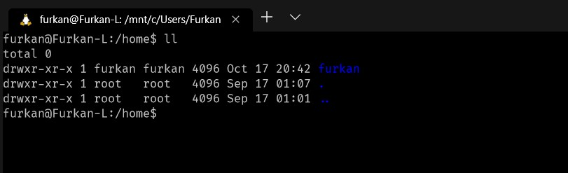

## Linux Alias Tanımlama

Örnek olarak dizini detaylı bir şekilde listelemek istediğimde sürekli “ls -alt” komutunu kullanmak yerine ben bu işlemi sadece “ll” komutuna atayıp aynı işi yaptırmak istiyorum.

İstenilen alias sadece o oturum için yapılacaksa direk terminal ekranına

```
alias ll='ls -alt --color=auto'
```

yazıp artık oluşturduğum ll komutunu kullanabilirim. Ancak yapılan bu işlemin kalıcı olmasını istiyorsak farklı işlemler yaparız.

Bunun için ilk olarak “/etc/profile” dosyası vi editörü ile root yetkisinde açıyoruz.

```
sudo vi /etc/profile
```


Açılan dosyanın en alt satırına inilerek insert moda(‘i’ tuşuna basılır) geçilir. Kalıcı olmasını istetiğiniz aliasları buraya girebilirsiniz.

```
alias ll='ls -alt --color=auto'
```


İstenilen komutlar yazıldıktan sonra insert moddan çıkılarak(Esc) dosya kayıt edilir(:wq). Yapılan değişikliklerin geçerli olaması için

```
source /etc/profile
```
komutu yazılır.


Artık alias verdiğimiz komutu kullanabiliriz.

```
ll
```


