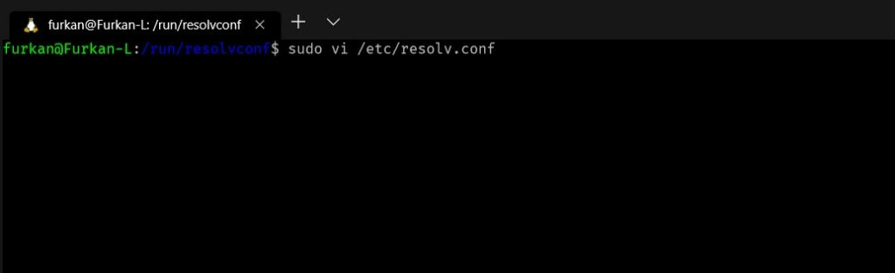
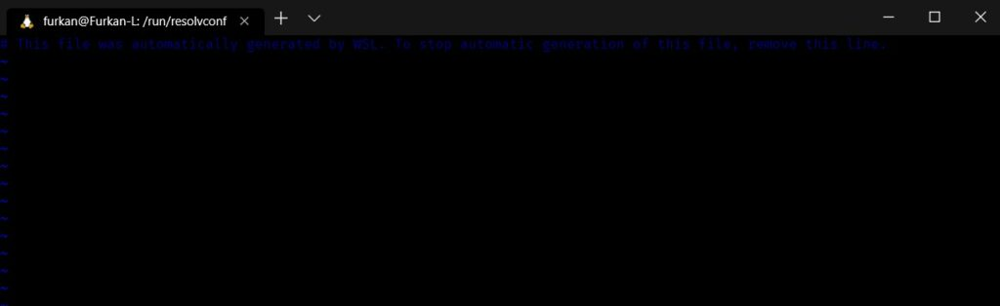
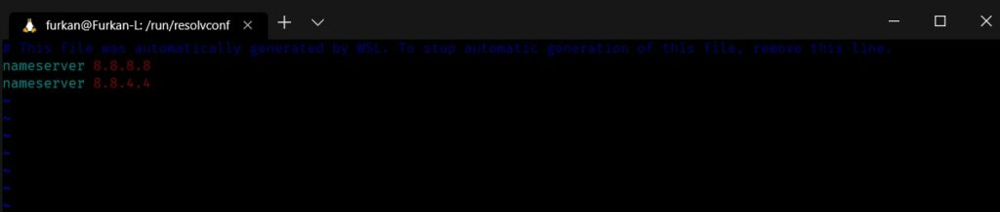

## Linux DNS Değiştirme ve Ekleme

Linux işletim sistemlerinde DNS değiştirme ihtiyacı olanlar için veya tanımlı olmayanlar için DNS eklemeyi göstereceğim.

Linux işletim sistemlerinde DNS bilgisi /etc/resolv.conf dosyası içerisinde tutulur ve DNS değiştirme veya ekleme işlemleri sırasında bu dosya düzenlenir. İlk olarak dosyayı vi editörü ile root yetkisinde açıyoruz.

```
sudo vi /etc/resolv.conf
```





Ardından dosya içerisine ekleme veya düzenleme yapmak için ‘i’ tuşuna basıp insert moda geçiyoruz ve istediğimiz DNS adresini yazıyoruz.

```
nameserver 8.8.8.8
nameserver 8.8.4.4
```



İnsert moddan çıkmak için ‘Esc’ tuşuna basıyoruz ve ‘:wq’ ile kayıt edip çıkıyoruz.