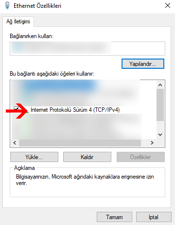
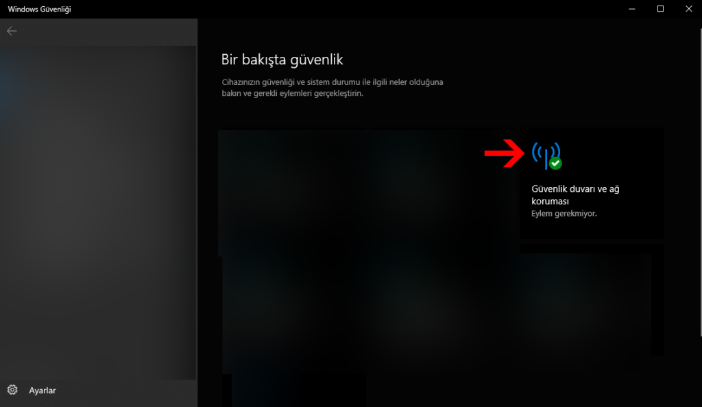

## Uzak Masaüstü Bağlantısı

#### Adım 1: Ip Düzenleme.(Tüm işlemler bağlanılacak bilgisayarda yapılacak.)

Uzak masaüstü bağlantısı için öncelikle bağlanılacak bilgisayarın ip si belirlenir.

Komut istemi(Cmd) açılarak ipconfig yazılarak bilgiler kontrol edilir ve senaryo oluşturulur.

Bilgisayarımız otomatik olarak 192.168.1.2 ip adresini almış görünüyor.

**Senaryo:**

WAN IP:85.97.92.32 (servis sağlayıcınız tarafından sizi verilen ip)

Makine LAN IP:192.168.1.80 (lokal olarak router’ınız tarafından makinanıza atatan ip)

Senaryoya göre wan ipsi 85.97.92.32 olan ve lan ipsi 192.168.1.80 olan bilgisayara uzak masaüstü bağlantısı yapacağız.

İlk olarak bilgisayarımızın ipsini ayarlıyoruz.

Bunu manuel ayarlamak için aşağıdaki adımlar uygulanır.

Başlat menüsünüsü > Ayarlar > Ağ ve İnternet > Bağdaştırıcı seçeneklerini değiştir yolu takip edilir.

Daha sonra bağlı olduğunuz ağa sağ tıklayarak özellikler yolu izlenir.

Açılan pencerede İnternet Protokolü Sürüm 4(TCP/IPv4) seçeneği çift tıklanır.

Aşağıdaki IP adresini kullan seçeneği aktif hala getirilir.

Senaryoya göre bilgileri girelim.

IP adresi: 192.168.1.80

Alt ağ maskesi: 255.255.255.0

Varsayılan ağ geçidi: 192.168.1.1

Tamam > Tamam deyip bilgisayarımız ip almış mı komut istemi ile kontrol edelim.

#### Adım 2: Port Açma(Tüm işlemler bağlanılacak bilgisayarda yapılacak.)

Uzak Masaüstü Bağlantısı Portu: 3389

Uzak masaüstü bağlantısı yapabilmemiz için 3389 portunu açmamız lazım bunun için modem ara yüzünden portu açıyoruz.

Modem arayüzleri modemden modeme değişiklik gösterebilir. Ama yapılan işlem genel olarak aynıdır.

Modem ara yüzüne girdiğinizde Gelişmiş > Nat > Sanal Sunucu sayfasına girilir.

Servis tipini “kullanıcı tanımlı” yapıp isim veriyoruz ben “uzak” yazıyorum.

Protokol: TCP

WAN Ayarı: Arayüz

WAN Arayüzü: Internet

WAN Portu: 3389

LAN Portu: 3389

LAN IP Adresi: 192.168.1.80

Olacak şekilde düzenleyip ekle butonuna basıp kayıt ediyorum.

Yapılan düzenlemeyi sayfayı aşağı kaydırarak görebilirsiniz.

Buraya kadar her şey yolundaysa adım 3’e geçebiliriz.

#### Adım 3: Uzak Masaüstü bağlantısı Bağlanma(Tüm işlemler bağlantı yapacak bilgisayarda yapılacak.)

Bağlantı yapılacak ve bağlantı yapacak bilgisayarlar aynı ağdaysalar WAN ip ile bağlantı yapılamaz. Lan ip ile bağlantı yapmalısınız.

Bunun için bağlantı yapacak olan bilgisayarı farklı ağa bağlıyoruz. (Telefon dan mobil hotspot ile bağlandım)

Uzak bağlantı aracını çalıştırmak için komut istemine “mstsc” yazabilirsiniz.

Aşağıdan seçenekleri göster kısmına tıklıyoruz.

Açılan ara yüzde bilgisayar kısmına WAN IP‘mizi yazıyoruz.

WAN IP Öğrenmek için: https://whatismyipaddress.com/tr/ip-im

Kullanıcı adı kısmına bağlantı yapacağımız bilgisayara ait kullanıcı adını giriyoruz.

Bağlan butonuna tıklıyoruz ve uzak bağlantımızı başlatıyoruz.

Eğer bu adımda bağlantı başlatılamazsa adım 4 uygulanır.

#### Adım 4:  Güvenlik duvarı ve ağ koruması.( Tüm işlemler bağlanılacak bilgisayarda yapılacak.)

3 adımda bağlantımızın başlamamasının sebebi güvenlik duvarı ile ilgili olabiliyor bunun için güvenlik duvarının kapatmamız gerekiyor.

Görev Çubuğu sağ tarafında yukarı ok’a tıklanır ve açılan kutudan windows güvenliği açılır.

Güvenlik ve ağ koruması açılır.

Hangi ağ etkinse ona tıklanalarak windows defender güvenlik duvarı kapalı konumana getirilir.

Tekrar uzak bağlantı yapılır muhtemelen bu adımdan sonra bağlantınız sağlanacaktır.
